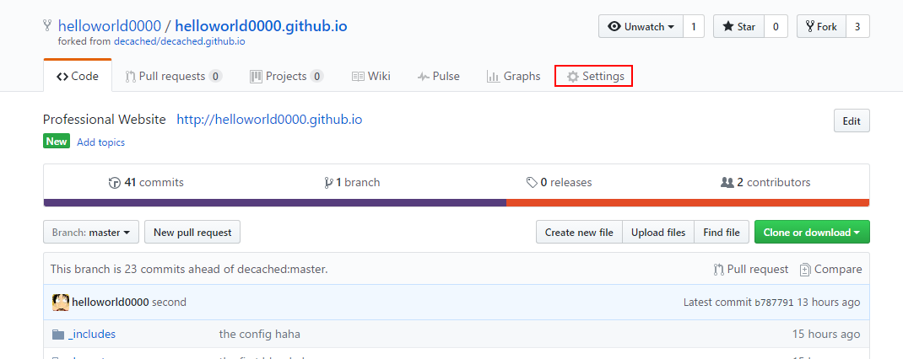
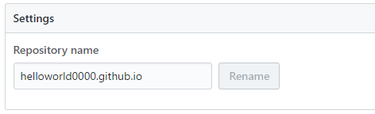
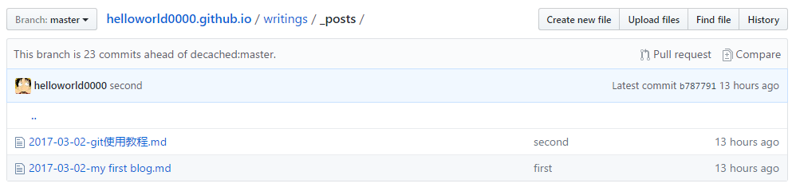

# github page 使用小教程

昨天闲来无聊配置了自己的github page，准备在上面写点笔记和文字之类的东西，实验室的伙伴们竟然很感兴趣让我出乎意料呢，那就分享一下我配置的过程吧，一切从简，以简单节省时间为主。


## 选择一个自己喜欢的模板（或者自己写一个）

现在开源的很模板很多很多呢 **Jekyll**用作静态站点的生成器，它会根据网页源码生成静态的文件，它提供了模板、变量、插件等功能，所以实际上可以用来编写整个网站。

**整个思路到这里就很明显了。你先在本地编写符合Jekyll规范的网站源码，然后上传到github，由github生成并托管整个网站。**

但是，我很懒，懒得出奇，于是直接Fork了一个已经写好的个人主页模板，然后稍微改改就可以得到自己的个人主页网站啦。

- **如果要选择自己写一个的话，大概思路如下**：

- 首先在本地创建一个自己的文件夹**

  对该目录使用git初始化（对git不熟悉的同学可以去参考上一篇教程）

  ```
  git init
  ```

   创建配置文件（根目录下创建一个_config.yml 的配置文件）

  ```
  _config.yml
  ```

  官方网站：https://github.com/mojombo/jekyll/wiki/Configuration

  在根目录下创建一个 _layouts目录，用于存放模板文件

  进入该目录，创建一个default.html文件，作为Blog的默认模板

  ```
  default.html
  ```

  Jekyll使用Liquid模板语言，

  ```
  page.title表示文章标题
  content表示文章内容 （使用{{  }} 作为变量的引出）
  更多模板变量请参考官方文档。
  ```

  ​

  回到项目根目录，创建一个_posts目录，用于存放blog文章。

​       由于是自己写一个，所有html，css ，js 基础肯定是有的，就不用我多说了。

- **懒得出奇版本，直接fork一个别人已经配置好的，然后做以下改动**：

  1. FORK之后可以在自己的主页里看到了：

     

  2. 点击右上角的settings 把Repository name 改成自己的username.github.io

     

  3. 现在就可以进行访问了呢，直接访问 helloworld0000.github.io 就可以跳转到index.html了，剩下的可就是修改自己的配置信息，对bootstrap应该也有一定的了解吧，大部分都是使用bootstrap写的，没有什么难度，自己改改就好了，改成自己的个人主页，添加标签分类等等，不会的话就去查bootstrap的官网吧，以后有时间的话再好好给自己的个人主页做一个高大上的模板吧。

  4. 对我这个来说，所有的bolg 都在_post 这个路径中了，我在本地将git clone 下来用markdown写blog

     写完以后再push上去就大功告成啦。

     

  5. 是不是非常简单呢，以后就可以经常写自己的小博客啦。

  6. 可能会遇到中文乱码问题，但是编辑时一定要使用 UTF-8 编码就不会遇到这种问题啦。需要细心一点。

     ## 大功告成

     哇哇，真的好简单，感谢github 给我们自己的小空间，不仅托管我们的代码，还可以托管自己的文章，要知道如果租空间的话一年还是要几百块钱的呢。

     今天的任务，xgboost继续调参吧，可以试试分布式应该会快很多

     ps：salesforce 的坑也该开始了呢。

     ​