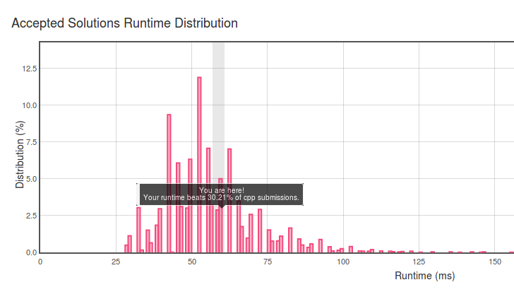

# Leetcode ---Add Two Numbers

今天听师兄说要奋战然后刷题找工作了，自己编程基础也不好需要好好打好基础才是呢，于是决定真的每天要开始刷题啦，各位兄弟伙伴们求监督。废话不多说了，开始啦！


题目要求：

You are given two **non-empty** linked lists representing two non-negative integers. The digits are stored in reverse order and each of their nodes contain a single digit. Add the two numbers and return it as a linked list.

You may assume the two numbers do not contain any leading zero, except the number 0 itself.

**Input:** (2 -> 4 -> 3) + (5 -> 6 -> 4)
**Output:** 7 -> 0 -> 8

题目很简单，理解起来也很简单呢，就是说，两个链表倒序排列，依次是个位，十位，百位数。。。然后求和。

这样思路大致就出来了。

对应位的数值求和，很简单的，如果是说有难度的话那最多也就是那一个进位的问题了。

```
if （两个链表都不是末尾 || 有最后一个进位）{
  //有操作
  具体操作{
    if（是链表的末尾，没有值了，那就赋值为0）
    对应相加，如果超过10，取个位，并给进位符 +1
  }
}
else{
  //直接返回result的链表即可
}
```

```

```

看起来很简单的样子，可是到这里戛然而止，因为我忘记了c++的结构体之类的东西了，也忘记了如何声明，但是还是要锻炼一下自己的编程能力呢，回去查啦！

```
/**
 * Definition for singly-linked list.
 * struct ListNode {
 *     int val;
 *     ListNode *next;
 *     ListNode(int x) : val(x), next(NULL) {}
 * };
 */
 结构体的定义


ListNode *head = (ListNode *)malloc(sizeof(ListNode));
//声明一个头结点
ListNode *now = head;
ListNode *node = NULL;
node = (ListNode *)malloc(sizeof(ListNode));
node->val = 1000;
node->next = NULL;
now->next = node;
now = node;
```

复习完可以写了呢，嘿嘿

```
/**
 * Definition for singly-linked list.
 * struct ListNode {
 *     int val;
 *     ListNode *next;
 *     ListNode(int x) : val(x), next(NULL) {}
 * };
 */
class Solution {
public:
    ListNode* addTwoNumbers(ListNode* l1, ListNode* l2) {
        
        ListNode *head = (ListNode*)malloc(sizeof(ListNode));
        ListNode *now = head;
        ListNode *node = NULL;
        int ifmorethanten = 0;
        int l1value;
        int l2value;
        int sum;
        while (l1!=NULL || l2!=NULL || ifmorethanten!=0){
            if (l1== NULL){
                l1value = 0;
            } else{
                l1value = l1->val;
            }
            if (l2== NULL){
                l2value = 0;
            } else{
                l2value = l2->val;
            }
    
            sum = l1value+l2value+ifmorethanten;
            if (sum<10){
                node = (ListNode*)malloc(sizeof(ListNode));
                node->val = sum;
                node->next = NULL;
                ifmorethanten = 0;
                now->next = node;
                now = node;
    
            } else{
                node = (ListNode*)malloc(sizeof(ListNode));
                node->val = sum%10;
                node->next = NULL;
                ifmorethanten = 1;
                now->next = node;
                now = node;
            }
            l1 = (l1 == NULL ? NULL : l1->next);
            l2 = (l2 == NULL ? NULL : l2->next);
    
    
    
        }
        return head->next;
        
    }
};
```



这个是结果，感觉不太好，速度不是很好呢lol，然后想了一下，如果说有一个链表很长一个很短最后只剩下一个可以直接将剩下的位数写过来，不需要求和和比较了！应该还会有更好的方法，可以告诉我嘿嘿。

https://github.com/helloworld0000/leetcode/blob/master/main.cpp 