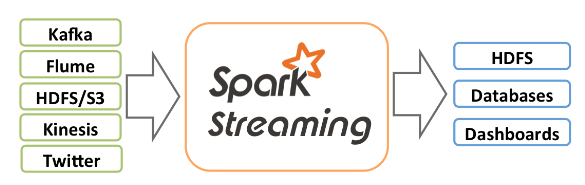
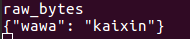
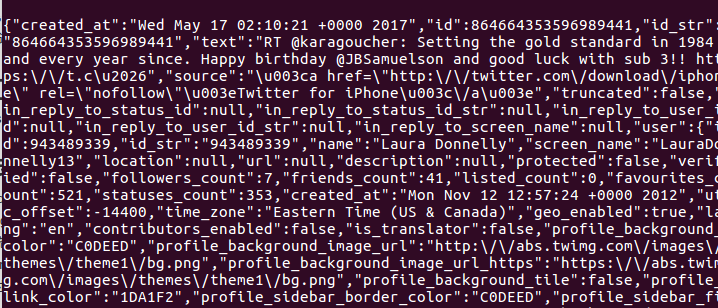

# Spark steaming USE python

使用spark steaming，python，twitter API 进行实时分析数据。

Spark streaming是Spark核心API的一个扩展，它对实时流式数据的处理具有可扩展性、高吞吐量、可容错性等特点。我们可以从kafka、flume、Twitter、 ZeroMQ、Kinesis等源获取数据，也可以通过由 高阶函数map、reduce、join、window等组成的复杂算法计算出数据。最后，处理后的数据可以推送到文件系统、数据库、实时仪表盘中。



由于现在，我们需要使用来获取twitter并实时分析twitter数据。


spark streaming 接收实时的数据流，然后将这些数据切分为批数据提供给spark进行处理，spark引擎将数据生成最终的结果数据。

引入了Dstream，是由一系列的RDDs组成的。

#### twitter API 注册

我已经注册过了，就不需要继续注册了。记住自己的token。

由于无论是kafka集群，还是producer，consumer都依赖于Zookeeper来保证系统可用性集群保存一些Meta信息，因此我们首先要安装Zookeeper。

#### Zookeeper 的安装

```shell
wget http://apache.claz.org/zookeeper/zookeeper-3.4.10/zookeeper-3.4.10.tar.gz
cp zoo_sample.cfg zoo.cfg
vim zoo.cfg

dataDir=/home/ming/workspace/zookeeper-3.4.10/data   数据目录
dataLogDir=/home/ming/workspace/zookeeper-3.4.10/logs  日志目录
clientPort=2181     客户端连接端口
tickTime=2000     Zookeeper 服务器之间或客户端与服务器之间维持心跳的时间间隔，也就是每个tickTime 时                   间就会发送一个心跳。
initLimit=5   Zookeeper的Leader 接受客户端（Follower）初始化连接时最长能忍受多少个心跳时间间隔数。当已经超过5个心跳的时间（也就是tickTime）长度后Zookeeper 服务器还没有收到客户端的返回信息，那么表明这个客户端连接失败。总的时间长度就是5*2000=10 秒
syncLimit=2   表示Leader 与Follower 之间发送消息时请求和应答时间长度，最长不能超过多少个tickTime 的时间长度，总的时间长度就是2*2000=4 秒。
server.1=master:2888:3888
server.2=slave1:2888:3888
server.3=slave2:2888:3888
server.A=B：C：D：其中A 是一个数字，表示这个是第几号服务器；B 是这个服务器的ip 地址；C 表示的是这个服务器与集群中的Leader 服务器交换信息的端口；D表示的是万一集群中的Leader 服务器挂了，需要一个端口来重新进行选举，选出一个新的Leader，而这个端口就是用来执行选举时服务器相互通信的端口。如果是伪集群的配置方式，由于B 都是一样，所以不同的Zookeeper 实例通信端口号不能一样，所以要给它们分配不同的端口号。
```

```shell
这是我的机器情况，按照这个写入datadir下的myid文件
192.168.7.87    master    myid=1
192.168.7.88    slave1    myid=2
192.168.7.89    slave2    myid=3

mkdir data
mkdir logs
vim myid 输入对应的数字
scp 发送到slaves -r为递归的传送整个目录
scp -r /home/ming/workspace/zookeeper-3.4.10 ming@slave1:/home/ming/workspace/
scp -r /home/ming/workspace/zookeeper-3.4.10 ming@slave2:/home/ming/workspace/
修改每台机子的myid

```

```
配置环境变量
export ZOOKEEPER_HOME=$WORK_SPACE/zookeeper-3.4.10/
export PATH=$PATH:$ZOOKEEPER_HOME/bin:$ZOOKEEPER_HOME/conf

启动和停止（三台机子分别执行）
zkServer.sh start
zkServer.sh stop
```

1494816588788](../../images/writings/1494816588788.png)

成功！

#### KafKa的安装部署

kafka是一种高吞吐量的分布式发布订阅消息系统，有如下的特性：

- 通过O(1)的磁盘数据结构提供消息的持久化，这种结构对于即使数以TB的消息存储也能够保持长时间的稳定性能。

- 高吞吐量：即使是非常普通的硬件kafka也可以支持每秒数十万的消息。

- 支持通过kafka服务器和消费机集群来分区消息。

- 支持Hadoop并行数据加载。

    ```shell
    #首先下载安装包
    wget http://apache.claz.org/kafka/0.10.2.0/kafka_2.11-0.10.2.0.tgz
    #解压
    tar -xzf kafka_2.11-0.10.2.0.tgz
    cd kafka_2.11-0.10.2.0/
    #配置
    vim config/server.properties
    broker.id=1
    port=9092
    log.dirs=/---
    host.name=----
    zookeeper.connect=master:2181,slave1:2181,slave2:2181
    #把host.name改成相应的主机名；broker.id不能相同，逐个加1便可
    #启动kafka server

    bin/kafka-server-start.sh config/server.properties &
    &”号是为了让在后台运行，要不还要在手动放后台或者重新开启一个终端窗口。
    #
    ```

新建一个topic并使用命令行进行测试：

```shell
ming@master:~/workspace/kafka_2.11-0.10.2.0$ bin/kafka-topics.sh --create --zookeeper master:2181 --replication-factor 1 --partitions 1 --topic test
```

list所有的topic：

```
bin/kafka-topics.sh --list --zookeeper master:2181
test
```

模拟发送接收消息：

```shell
#send producer
bin/kafka-console-producer.sh --broker-list master:9092 --topic test
#输入一些消息

#开启一个consumer 消费消息
bin/kafka-console-consumer.sh --bootstrap-server master:9092 --topic test --from-beginning
#输出刚刚的消息
```

#### 使用python操作Kafka

**kafka Producer**

使用python连接kafka，并向kafka生产消息

```python
from kafka import KafkaProducer
from kafka.errors import KafkaError

producer = KafkaProducer(bootstrap_servers=['master:9092'])  
```

这里的bootstrap_servers=['master:9092']解释一下，为啥是9092端口而不是2181端口是因为我们是在连接producer服务器，当然要去查找producer的端口号，看一下该文件的配置：

```shell
vim config/producer.properties
bootstrap.servers=localhost:9092
#consumer 也是同理 
```

向kafka发送消息

```python
future = producer.send('test', b'message')
try:
    record_metadata = future.get(timeout=10)
except KafkaError:
    # Decide what to do if produce request failed...
    log.exception()
    pass
# Successful result returns assigned partition and offset
print (record_metadata.topic)
print (record_metadata.partition)
print (record_metadata.offset)

#result 成功
twitter-stream
0
101
```

回到目标主题，我们需要获取twitter的数据，而twitter的数据的json格式，因此需要掌握如何向kafka发送json格式的数据：

```python
# produce json messages
import json
data = {'wawa':'kaixin'}
producer.send('twitter-stream',json.dumps(data).encode('utf-8'))
```



命令行运行consumer发现刚刚发送的消息都在，成功！很开心，因此我们可以进行下一步了，根据关键词获取tweets。这可真是我写的目前为止最有营养的一篇博客了lol。

#### 根据关键词获取tweets

tweeter官方有API，所以这一步还是非常简单的，不用什么时间就可以搞定，但是，不幸的是我们处于万里长城之下，因此翻长城很重要，如何翻墙配置全局代理请参考之前的教程即可。

```python
#  -*- coding: utf-8 -*-
import tweepy
from tweepy.streaming import StreamListener
from tweepy import OAuthHandler
from tweepy import Stream

#获取自己的token
access_token = "85393391698------"
access_token_secret = "P1GEM7e9OO--------"
consumer_key = "ZIlFlmezN--------"
consumer_secret = "KSlOk6v6xF--------"

auth = OAuthHandler(consumer_key,consumer_secret)
auth.set_access_token(access_token,access_token_secret)

#需要注意的是要进行翻墙所以需要设置proxy
proxies = { "http": "http://127.0.0.1:8123",
            "https": "http://127.0.0.1:8123",}

api = tweepy.API(auth,proxy="127.0.0.1:8123")
class MyListener(StreamListener):
    def on_data(self, data):
        try:
            with open('lenovo.json', 'a') as f:
                f.write(data)
                print(data)
                return True
        except BaseException as e:
            print("error")
        return True

    def on_error(self, status):
        print(status)
        return True

twitter_stream = Stream(api.auth, MyListener(), proxies=proxies)
#要获取所有美国的数据，所以英文即可，也好进行处理
twitter_stream.filter(languages=["en"],track=['lenovo'])
```

这里 

```python
twitter_stream = Stream(api.auth, MyListener(), proxies=proxies)
```

由于Stream中并不会接收proxies参数，因此需要修改一下源代码，修改streaming.py中的源代码

```python
#查看tweepy源代码的streaming.py可以发现Stream并不支持代理访问。但庆幸的是，Tweepy uses ‘requests’ package for sending request。我们可以使request实现代理呀。
路径：/usr/local/lib/python3.5/dist-packages/tweepy

def __init__(self, auth, listener, proxies, **options):
        self.auth = auth
        self.listener = listener
        self.proxies = proxies
        
def new_session(self):
        self.session = requests.Session()
        self.session.headers = self.headers
        self.session.params = None
        self.session.proxies = self.proxies
	    
               resp = self.session.request('POST',
                                            url,
                                            data=self.body,
                                            timeout=self.timeout,
                                            stream=True,
                                            auth=auth,
                                            verify=self.verify,
                                            proxies=self.proxies)
对应的修改这几个位置就可以了。

```

#### 问题又来了，401错误解决

https://dev.twitter.com/overview/api/response-codes

查了一下401错误的原因，我的是因为时间不同步，所以为了防止不必要的麻烦，设置时间同步网络时间。

```shell
sudo dpkg-reconfigure tzdata
sudo date -s ""
sudo cp /usr/share/zoneinfo/Asia/Shanghai /etc/localtime  
sudo apt-get install ntpdate
sudo ntpdate cn.pool.ntp.org
sudo hwclock –systohc
sudo apt-get install ntp
sudo vim /etc/ntp.conf  #server ntp.ubuntu.com
sudo /etc/init.d/ntp start

```

时间同步后，发现问题解决，大把大把的data奔来



#### 从kafka中消费消息

到这里已经全部解决了获取数据并将数据传入kafka的过程，接下来需要进行下一个过程，就是从kafka中消费消息，进行处理。

```shell
 $SPARK_HOME/bin/spark-submit --packages org.apache.spark:spark-streaming-kafka-0-8_2.11:2.1.0 spark-stream-tweets.py
```

提交程序