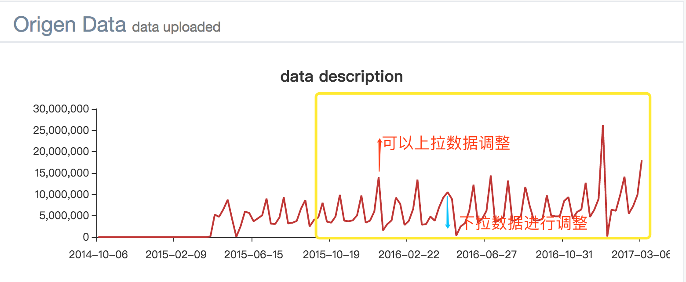

# 预测系统进一步需求

## 预测功能模块

1. 注册域名换掉目前的ip地址

2. 页面的title换成统一的产品名称

3. 填写特征的地方需要有提示是什么特征

4. 右上角用户信息处：加购买的期限、购买的版块、以及登出信息

5. 错误类别提示：1、文件类型错误，2、上传的数据不符合模板格式，3、上传文件过大等

6. 生成的模板也要改成英文

7. excel分析的控件

8. 再次看预测过的数据时，需要将原始数据以表格的形式呈现另外加return返回上一层

9. 默认值是自动填上的不是灰色提示

10. 计算过程进度要在已经预测处进行同步显示预测了多少

11. 已经预测完的列表处加一列任务名称，可以让用户编辑，方面查找

12. 已经预测完的列表处默认进行时间排序，加入可以搜索的功能。

13. 预测值要有对应的结果信息，序号换成时间截点等，至少要保留原有的数据的信息

14. js画的图是否可以放大。

15. lstm多个小产品预测，只预测其中的一个产品

16. lstm预测后的时间显示不准确

17. 自动默认选择结果最好的算法

18. 报告改为英文

    ​

## 相似性预测功能模块

主要针对于AZ带有特征的数据

大致描述：在home页面添加按钮，查看数据的特征相似度，【-1，1】之间的数，在数据显示页面中，需要显示原始数据的预测值以及其他特征的曲线。原始数据的基础统计画图，不同特征的相关系数画图，正反不一样颜色，柱状图。相关性结果列表。原始数据列表（注意：原始数据可能过多，控制控件大小，需要翻页）

所需任务列表：

1. 分为两部分，原始数据部分和相关性预测结果部分，为两个接口返回数据，ajax异步加载请求，由于时间问题。相关性结果请求不到时，显示loading。接口返回数据格式或类型看怎样方便。

2. echart图表格式选择，折线图or柱状图。

3. 原始数据表格，注意要控制大小，数据量过大时可翻页或者下拉。

4. 相关性结果显示表格，每一个特征与目标值相关度排序，注意要控制大小，数据量过大时可翻页或者下拉。

5. 相关性结果显示图，排序后显示，柱状图，轴上和轴下。echart里有。

6. 生成报告，导出pdf报告。

7. 图表为可选择区间的。在图片上进行区间选择。触发重新计算相关性。

   ​

   ​

## 沙盘演兵功能模块

主要针对于AZ带有特征的数据

大致描述，训练出的模型要保存，AZ通过调整某些特征的值来看，这些特征是否对结果有影响？影响是多少，如何影响？这部分他们的要求有点儿变态。

所需任务列表：

1. 画图，原始数据图，图表如上。

2. 每次可以选择一个特征进行预览，预览图要求可以进行调整，上下调整。调整后显示出预测出的值。

3. 表格可调整，可以更改其中数据放入模型中。

4. 区间可选择。

   

​                                    黄色部分为区间选择，选择指定区间，上拉数据，下拉数据进行调整。

5. 调整可以在图中调整，在表格中调整，也有一键调整的选项，比如全部变为1.1倍，0.9倍等。
6. 调整后出对比图，预测出的走势。
7. 生成报告。

