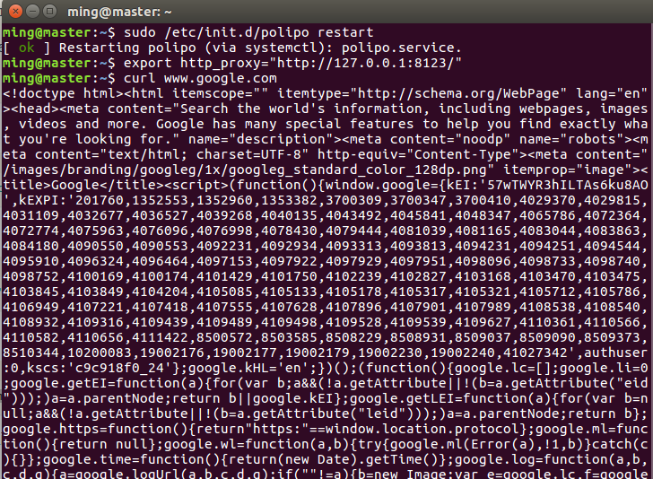

# Ubuntu server 命令行配置 VPN

使用的shadowsocks代理，是我认为比较好用的，自己可以买一个美国的小服务器搭建，非常简单，这里就不再讲述了。

首先，由于ubuntu server是不带用户界面的，所以只能用命令行进行配置（目的是要集群抓取twitter数据，后续会有更新）

## 安装 shadowsocks

shadowsocks 是用python开发的 所以必须安装python

ubuntu 16 是自带python的我就不需要安装了，安装命令参考：

```
sudo apt-get install python
```

接下来安装python的pip：

```
sudo apt-get install python-pip
```

结束之后通过pip直接安装shadowsocks：

```
sudo pip install shadowsocks
```

## 配置shadowsocks

新建一个配置文件 shawdowsocks.json（这些参数是你搭建的shadowsocks服务器的参数）：

```
vim shawdowsocks.json
{
  "server": "server-ip",
  "server_port": 443,
  "local_port": 1080,
  "password": "password",
  "timeout": 800,
  "method": "aes-256-cfb"
}
```

```
sudo sslocal -c shawdowsocks.json -d start
```

## 配置全局的代理

shadowsocks 使用的是socks的服务，但是我们平时使用http请求，需要让我们的http请求请求socks 5 的路径，才能请求到我们的vpn服务器，再由vpn服务器请求数据返回。

为了让整个系统都走shadowsocks通道，需要配置全局代理，可以通过polipo实现

带有图形界面的电脑可以去浏览器进行相关的配置。例如chrome安装[SwitchyOmega]插件，设置proxy server也是十分方便的，也是我最喜欢的方式。

首先安装polipo：

```
sudo apt-get install polipo
```

修改配置文件 /etc/polipo/config: 将下面的内容添加进去：

```shell
proxyAddress = "0.0.0.0"
socksParentProxy = "127.0.0.1:1080"
socksProxyType = socks5
chunkHighMark = 50331648
objectHighMark = 16384
serverMaxSlots = 64
serverSlots = 16
serverSlots1 = 32
```

启动polipo：

```
sudo /etc/init.d/polipo restart
```

为终端设置代理：

```
export http_proxy="http://127.0.0.1:8123/"
#注意这里的 8123是polipo的端口
```

测试：

```
curl www.google.com 有内容即可成功
```



服务器重启后，需要执行 shadowsocks的启动，http代理的配置

```
sudo sslocal -c shawdowsocks.json -d start
sudo /etc/init.d/polipo restart
export http_proxy="http://127.0.0.1:8123/"
```

