# 神经网络 LSTM

http://colah.github.io/posts/2015-08-Understanding-LSTMs/

为了监督自己一字不差的理解好LSTM，我决定翻译一下方便自己以后再看。上面是英文原文的地址。

### RNN（循环神经网络）

我们不会每秒钟都从头开始思考，当你阅读文章的时候，你理解每个单词都基于你对之前单词的理解，不会把所有的都忘掉再从头开始学习，人的思考是有持久性的。

传统的神经网络不能做到这一点，是一个主要的缺点。举个例子，想象一下，您想要分类电影中每一点发生的事件的种类。传统的神经网络如何能够利用其关于电影中以前的事件的推理来获知以后的事情是不清楚的。

循环神经网络解决了这个问题。他们是具有循环的网络，允许信息持续存在。

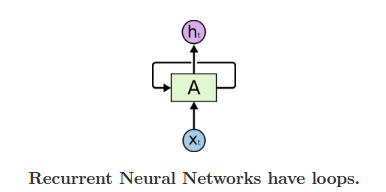

在上图中，神经网络的一个单元块， A，获取输入 $x_t$ ，输出$h_t$ ，循环允许信息从网络的一个步骤传递到下一个。

这些循环使得RNN看起来非常的神秘，然而，如果你可以多想一点，和普通的神经网络其实并没有什么不同，一个循环神经网络可以被认为同一个网络的多个副本，每一个都给后面的传递信息，考虑我们展开循环会发生什么：

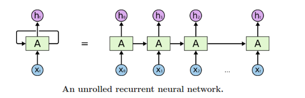

这种链状的特征揭示了循环神经网络与序列和列表密切相关，他们是用于此类神经网络数据的天然结构。

而且他们肯定是用的！ 在过去几年里，将RNN应用于语音识别，语言建模，翻译，图像字幕等各种问题已经取得了令人难以置信的成功。 我将讨论可以通过RNN实现的令人惊叹的长处，使Andrej Karpathy的优秀博客“反复神经网络的不合理有效性”成为可能。 但他们真的很神奇。

这些成功的关键在于使用“LSTM”，这是一种非常特殊的循环神经网络，对于许多任务来说，它们比基本版本好得多。 几乎所有令人兴奋的结果基于循环神经网络是通过他们实现的。 这篇文章将探讨这些LSTM。

### 长时问题

RNN的吸引人的之一是他们可能能够将先前的信息连接到当前任务的想法，例如使用先前的视频帧可以通知对当前帧的理解。 如果RNN可以做到这一点，他们将非常有用。 但可以吗？ 这视情况而定。

有时，我们只需要查看最近的信息来执行当前的任务。 例如，考虑一种语言模型，尝试基于以前的单词来预测下一个单词。 如果我们试图预测“云在天空中”的最后一个字，我们不需要任何进一步的语境 - 下一个字将是天空很明显。 在这种情况下，如果相关信息与所需地点之间的差距很小，则RNN可以学习使用过去的信息。

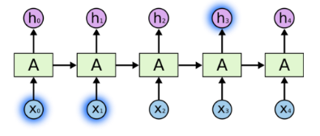

但也有需要更多上下文的情况。 考虑尝试预测文本中的最后一个单词“我在法国长大...我说流利的法语”。最近的信息表明下一个单词可能是一种语言的名称，但如果我们想缩小哪种语言，我们需要 法国的背景，从进一步回来。 相关信息之间的差距和需要变得非常大的点是完全可能的。

不幸的是，随着差距的增加，RNN无法学会连接信息。

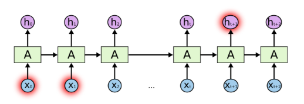

在理论上，RNN绝对有能力处理这样的“长期依赖”。人们可以仔细挑选参数来解决这种形式的玩具问题。 可悲的是，实际上，RNN似乎无法学习。 Hochreiter（1991）[German]和Bengio等人深入探讨了这个问题。 （1994），他们发现了一些很可能是困难的根本原因。

幸运的是，LSTM没有这个问题！

### LSTM

长时间内存网络（通常称为“LSTM”）是一种特殊的RNN，能够学习长期的依赖关系。 他们由Hochreiter＆Schmidhuber（1997）介绍，并被许多人进行了精细化和推广。1他们在各种各样的问题上工作得很好，现在被广泛使用。

LSTM是明确设计的，以避免长期依赖问题。 记住长时间的信息实际上是他们的默认行为，而不是他们难以学习的东西！

所有复发神经网络都具有神经网络重复模块链的形式。 在标准RNN中，该重复模块将具有非常简单的结构，例如单个$tanh$层。

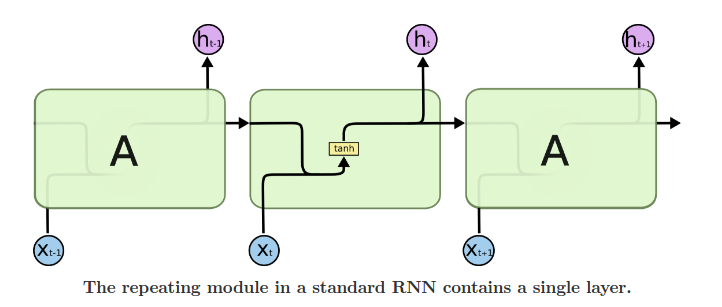

LSTM也具有这样的链结构，但重复模块具有不同的结构。 没有一个单一的神经网络层，有四个，以非常特殊的方式进行交互。

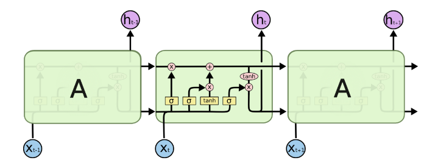

不要担心发生了什么的细节。 我们将逐步介绍LSTM图。 现在，让我们尽量让我们使用我们使用的符号。

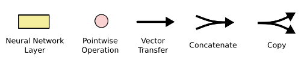

在上图中，每一行都带有一个整个向量，从一个节点的输出到其他节点的输入。 粉色圆圈表示点乘运算，如向量加法，而黄色框是学习神经网络层。 行合并表示串联，而行叉表示其内容正在复制，副本将转到不同的位置。

### LSTMs背后的核心理念

 LSTM的关键是细胞状态，水平线穿过图的顶部。

细胞状态类似于输送带。 它直接在整个链上运行，只有一些小的线性相互作用。 信息流畅地保持不变。                                                          

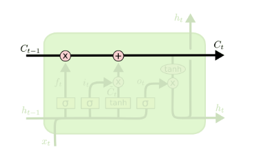

LSTM确实具有去除或添加信息到细胞状态的能力，由称为门的结构调节。

门是一种可选地让信息通过的方式。 它们由 sigmoid 神经网络层和点向乘法运算组成。

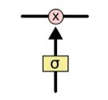

sigmoid 层的输出是在0-1之间的，用来描述多少的部分可以被通过。0值意味着 不允许任何通过，1则意味着允许所有的通过。

LSTM有三个门，用于保护和控制细胞状态。

### Step-by-Step LSTM Walk Through

我们的LSTM的第一步是决定我们要从单元格状态中丢弃什么信息。被称为遗忘门的sigmoid层所控制。在每个细胞状态$C_{t-1}$输入参数是$h_{t-1}$ 和 $x_t$ ,输出一个0-1之间的数字。1表示完全通过，0表示全部忘记。

我们回到我们的一个语言模型的例子，试图根据所有以前的语言来预测下一个单词。 在这样一个问题中，细胞状态可能包括当前受试者的性别，从而可以使用正确的代词。 当我们看到一个新主题时，我们想要忘记这个老主题的性别。

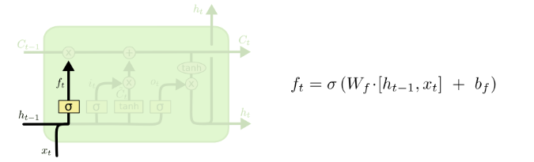

下一步是决定我们要在细胞状态下存储的新信息。 这有两部分。 首先，称为“输入门”的sigmoid层决定了我们将更新哪些值。 接下来，tanh层创建可以被添加到状态的新候选值$\widetilde{C}_t$的向量。 在下一步中，我们将结合这两个来创建对状态的更新。

在我们的语言模型的例子中，我们希望将新主题的性别添加到单元格状态，以替换我们忘记的旧对象。

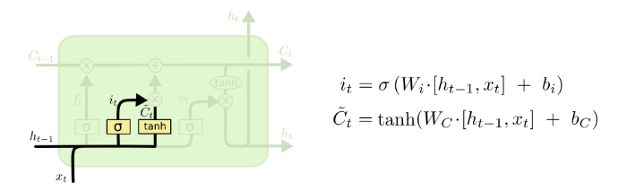

现在就到了将旧的单元状态$C_{t-1}$ 更新为$C_t$ 的时候了以前的步骤已经决定了做什么，只剩下做了。

我们将旧的状态乘 $f_t$ ,忘记了我们之前应该决定忘记的事情。  然后再加上 $i_t * \widetilde{C}_t$.这是新的候选值，按照我们决定更新每个状态值的多少来缩放。

在语言模型的情况下，我们实际上会放弃关于旧主题性别的信息，并添加新信息，就像我们之前的步骤中决定一样。

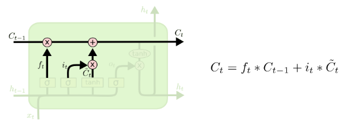

最后，我们需要决定我们要输出什么。 此输出将基于我们的细胞状态，但将是一个过滤版本。 首先，我们运行一个Sigmoid层，它决定了我们要输出的细胞状态的哪些部分。 然后，我们细胞线通过$tanh$（将值压缩到-1，1之间），并将其乘以Sigmoid门的输出，以便我们只输出我们想要的部分。

对于语言模型示例，由于它只是看到一个主题，它可能需要输出与动词相关的信息，以防下一步发生。 例如，它可能会输出主题是单数还是复数，以便我们知道，如果这是接下来的内容，动词应该如何组合在一起。

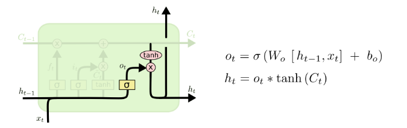

### LSTM 的变种

到目前为止，我所描述的是一个很正常的LSTM。 但并不是所有的LSTM都与上述相同。 事实上，似乎几乎每一篇涉及LSTM的论文都使用了一个略有不同的版本。 差异很小，但值得一提的是其中之一。

Gers＆Schmidhuber（2000）介绍的一种受欢迎的LSTM变体正在添加“窥视孔连接”。这意味着我们让门也取决于细胞线。

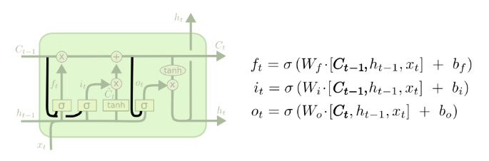

上面的图表增加了所有的门的窥视，但许多论文将给一些窥视，而不是其他。

另一种变化是使用耦合的忘记和输入门。 而不是单独决定要忘记什么，我们应该添加新信息，我们一起做出这些决定。 我们只会忘记我们要在什么地方输入内容。 当我们忘记旧的东西时，我们只会向国家输入新的值。

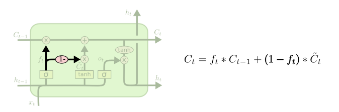

LSTM的一个稍微更显着的变化是由Cho等人介绍的门控循环单元或GRU。（2014）。 它将忘记和输入门组合成一个单一的“更新门”，它还合并了单元格状态和隐藏状态，并进行了一些其他更改。 所得到的模型比标准LSTM模型更简单，并且越来越受欢迎。

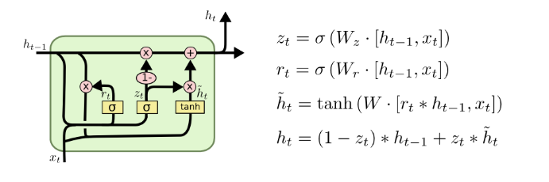

这些只是最显着的LSTM变体中的几个。 还有很多其他的，如姚等人的Depth Gated RNNs。（2015年）。 还有一些完全不同的处理长期依赖的方法，例如Koutnik等人的Clockwork RNNs。（2014）。

哪些变体最好？ 分歧是否重要？ Greff等人 （2015）做一个很好的比较流行的变种，发现他们都是一样的。 Jozefowicz等人 （2015年）测试了超过一万个RNN架构，发现某些工作在某些任务上比LSTM更好。

